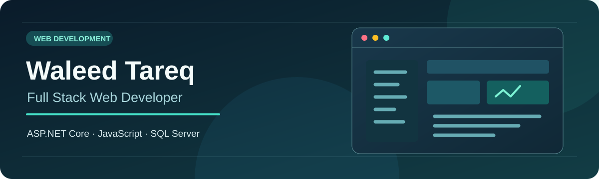

# Hi, I'm Waleed Tareq 👋

I'm a software engineering graduate in Amman, Jordan. I build web applications with **ASP.NET Core MVC**, **C#**, **Entity Framework Core**, and **SQL Server**, and I enjoy turning practical ideas into clear, usable interfaces with **HTML, CSS, Bootstrap, and JavaScript**.

### Featured web projects

- **[Musharaka](https://github.com/Waleed-Tareq/Musharaka)** — A university collaboration platform built with ABP and ASP.NET Core. It includes course communities, questions and answers, voting, reputation, search, and real-time chat.
- **[Al-Tayer Platform](https://github.com/Waleed-Tareq/AlTayer-Platform)** — My learning project exploring a campus ordering dashboard, merchant portal, and ASP.NET Core Web API.
- **[BloodLine MVC](https://github.com/Waleed-Tareq/BloodLine-MVC)** — An MVC web project.

### What I work with

**Backend:** C# · ASP.NET Core MVC · ABP Framework · Entity Framework Core · SQL Server  
**Frontend:** HTML5 · CSS3 · JavaScript · Bootstrap · Razor Pages  
**Tools and practices:** Git · GitHub · Docker · layered architecture · dependency injection · repository pattern

### A little more about me

- 🎓 B.Sc. in Software Engineering, Philadelphia University (2026)
- 💻 Full Stack Development intern at CDC Smart Systems
- 📊 Samsung Electronics B2B internship in data analysis and business development (Oct 2025 – Mar 2026)
- 🧩 Participated in multiple problem-solving competitions, including JCPC and the Code Crafters Club contest

### Connect

[LinkedIn](https://www.linkedin.com/in/waleed-tareq) · [Email](mailto:waleedselawe2004@gmail.com) · [Explore my repositories](https://github.com/Waleed-Tareq?tab=repositories)
